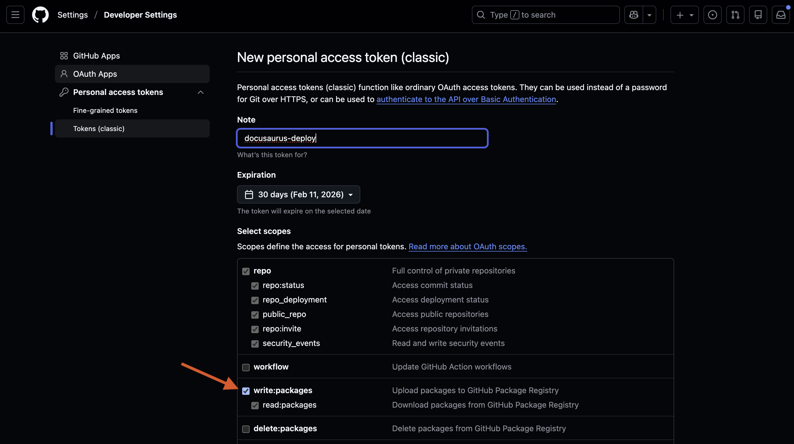
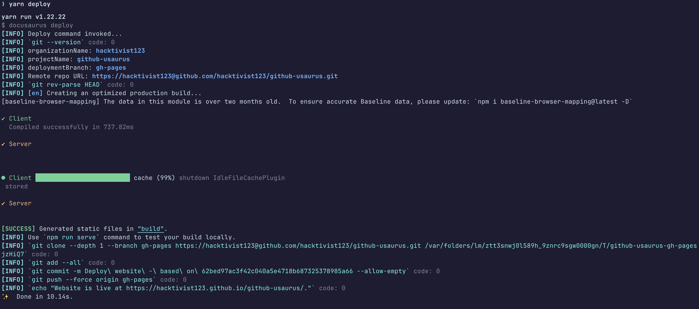
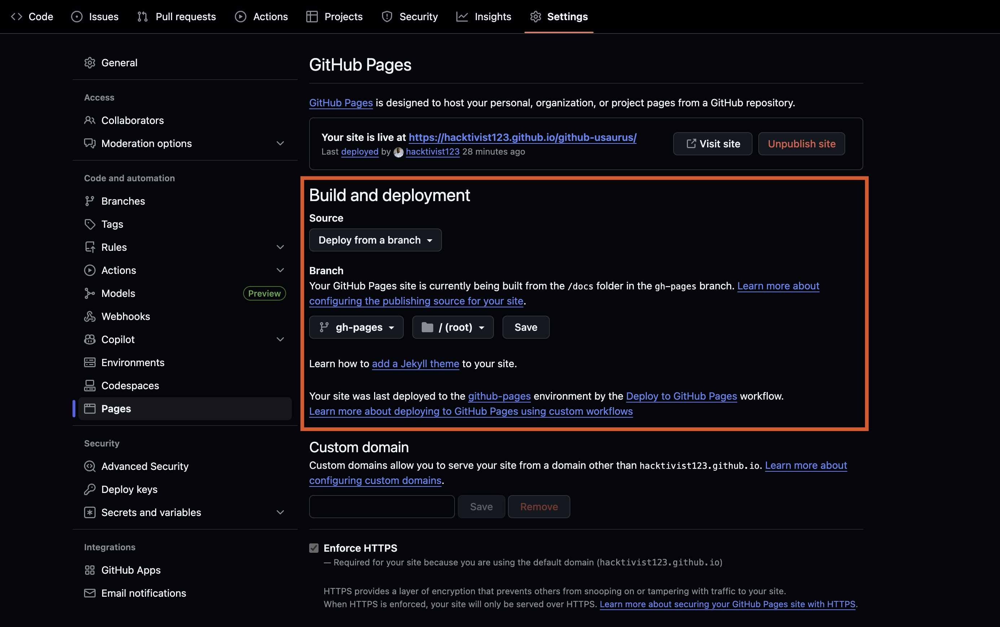
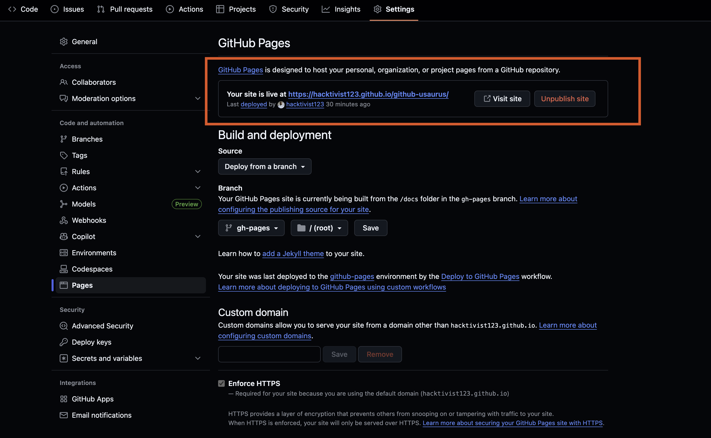
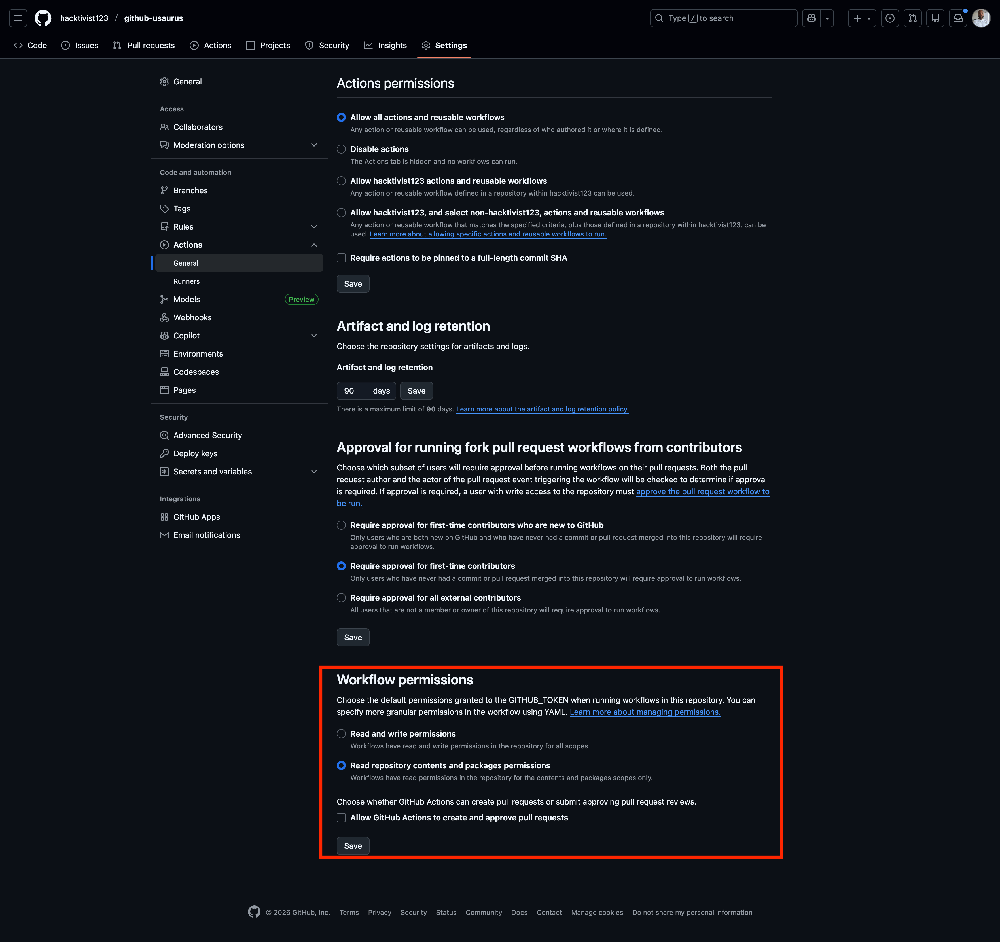
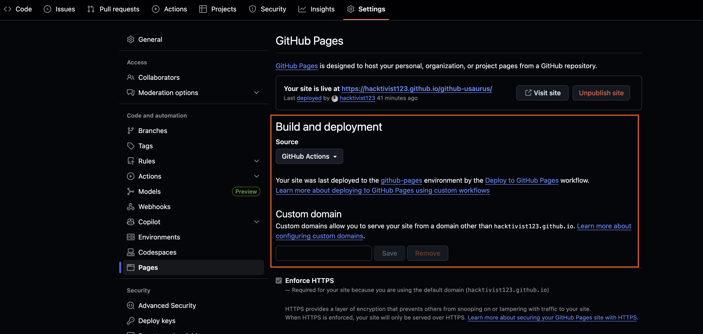
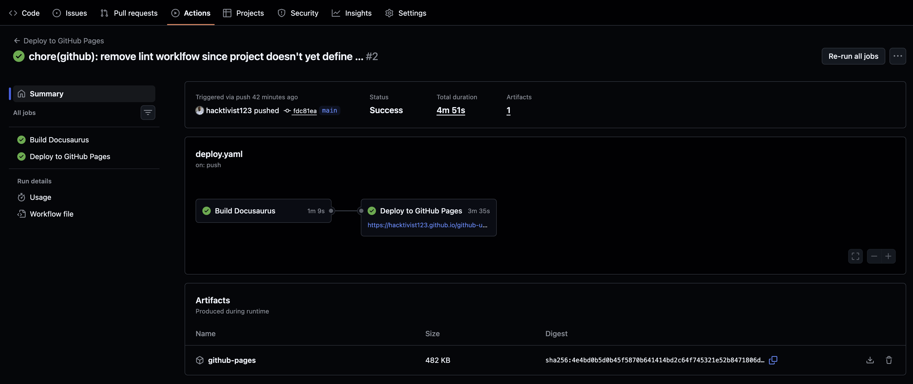

In this tutorial, you'll see how to deploy a Docusaurus website to GitHub Pages. This tutorial is intended for technical writers and developers who want to publish their documentation sites. It assumes you have knowledge of:

- Basic Git commands
- GitHub repositories
- Command-line interfaces
- Markdown syntax

By the end of this tutorial, you'll have seen how to:

- Configure your Docusaurus site for GitHub Pages deployment
- Deploy manually using the `yarn deploy` command
- Automate deployments with GitHub Actions
- Verify your deployed site is live

## Background

GitHub Pages is a static site hosting service that takes files from a GitHub repository and publishes them as a website. Docusaurus is a static site generator that works seamlessly with GitHub Pages, making it an excellent choice for hosting documentation sites.

There are two ways to deploy a Docusaurus site to GitHub Pages:

- **Manual deployment** using the `yarn deploy` command, which builds your site and pushes it to a `gh-pages` branch
- **Automated deployment** using GitHub Actions, which automatically deploys your site whenever you push changes to your main branch

## Before you start

Before you start the tutorial, you should:

- Have Node.js version 20.0 or above installed on your machine
- Have the Yarn package manager installed
- Have a GitHub account with a repository containing your Docusaurus project
- Have Git configured locally so you can pull and push to GitHub
- Have your Docusaurus site running locally (verify with `yarn start`)

:::important
GitHub Pages is only available for public repositories on free GitHub accounts. If your repository is private, you'll need a GitHub Enterprise Cloud or GitHub Enterprise Server account to use GitHub Pages. Alternatively, you can make your repository public to use GitHub Pages for free.
:::

## Configure Docusaurus for GitHub Pages

Before deploying, you need to configure your `docusaurus.config.ts` file with your GitHub Pages settings.

1. Open the `docusaurus.config.ts` file in your project root directory.

2. Locate the deployment configuration section and update the following fields:

   ```ts
   // Set the production url of your site here
   url: 'https://your-github-username.github.io',
   // Set the /<baseUrl>/ pathname under which your site is served
   // For GitHub Pages deployment, it is often '/<projectName>/'
   baseUrl: '/your-repository-name/',

   // GitHub Pages deployment config.
   // If you aren't using GitHub Pages, you don't need these.
   organizationName: 'your-github-username', // Usually your GitHub org/user name.
   projectName: 'your-repository-name', // Usually your repo name.
   ```

3. Replace the placeholder values with your actual GitHub username and repository name. For example, if your GitHub username is `hacktivist123` and your repository is named `github-usaurus`, your configuration should look like:

   ```ts
   url: 'https://hacktivist123.github.io',
   baseUrl: '/github-usaurus/',
   organizationName: 'hacktivist123',
   projectName: 'github-usaurus',
   ```

4. Save the file.

## Test your build locally

Before deploying to GitHub Pages, it's good practice to test your build locally to catch any errors.

1. Build your site:

   ```bash
   yarn build
   ```

   This command generates static content into the `build` directory. If there are any build errors, they'll appear here.

2. Serve the built site locally:

   ```bash
   yarn serve
   ```

   This serves the production build locally, allowing you to preview exactly what will be deployed. By default, it runs at http://localhost:3000/.

3. Open your browser and verify that all pages load correctly and links work as expected.

4. Press `Ctrl+C` in your terminal to stop the local server.

If the build completes successfully and the site looks correct locally, you're ready to deploy to GitHub Pages.

## Method 1: Manual deployment with yarn deploy

This method is useful for quick, one-off deployments or when you want full control over when your site is published. The `yarn deploy` command will automatically create a `gh-pages` branch in your repository if one doesn't already exist.

:::info
`gh-pages` is the default branch name that Docusaurus uses for deployment. You can customize this by setting the `deploymentBranch` property in your `docusaurus.config.ts` file or using the `DEPLOYMENT_BRANCH` environment variable. When you configure GitHub Pages later in this tutorial, you'll need to select whichever branch name you're using for deployment.
:::

### Set up environment variables

The deployment command requires two environment variables to authenticate and identify you.

1. Create a GitHub personal access token by visiting [GitHub's token creation page](https://github.com/settings/tokens/new).

2. Grant the token `package` scope (full control of private repositories) and Generate the token.

   

3. Copy your token and set the `NPM_GITHUB_AUTH_TOKEN` environment variable in your terminal:

   ```bash
   export NPM_GITHUB_AUTH_TOKEN="your-personal-access-token"
   ```

4. Set the `GIT_USER` environment variable to your GitHub username:

   ```bash
   export GIT_USER="your-github-username"
   ```

   :::tip
   Add these export commands to your shell profile (`.bashrc`, `.zshrc`, or `.bash_profile`) to avoid setting them every time you open a new terminal.
   :::

### Deploy the site

1. In the main branch, run the deployment command to build your site and push the built files to the `gh-pages` branch:

   ```bash
   yarn deploy
   ```

  This will build your site and push the built files to the `gh-pages` branch.

2. Wait for the command to complete. You should see output confirming the deployment was successful.

   

### Enable GitHub Pages

After your first `yarn deploy`, you need to configure GitHub Pages to serve your site from the `gh-pages` branch. This is a one-time setup, future deployments will automatically update your site.

1. Navigate to your repository on GitHub.

2. Click **Settings** in the repository menu.

3. Click **Pages** in the left sidebar.

4. Under **Source**, select **Deploy from a branch**.

5. Under **Branch**, select **gh-pages** and **/ (root)**, then click **Save**.

   

6. GitHub will display a message indicating your site is being deployed. Wait a few minutes for the deployment to complete.

7. Once deployed, GitHub will display your site's URL at the top of the Pages settings. Click the **Visit site** button to view your published documentation.

   

:::tip
After this initial setup, you can simply run `yarn deploy` whenever you want to publish changes - you won't need to touch the GitHub Pages settings again.
:::

## Method 2: Automated deployment with GitHub Actions

This method uses [GitHub Actions](https://docs.github.com/en/actions) to automatically deploy your site whenever you push changes to your main branch. GitHub Actions is a continuous integration and continuous delivery (CI/CD) platform that automates the build and deployment process, keeping your site up-to-date without manual intervention.

:::note
If you've already set up Method 1 and want to switch to GitHub Actions, you can do so without any conflicts. Simply follow the steps below to set up the workflow, then change your GitHub Pages source from "Deploy from a branch" to "GitHub Actions" in your repository settings. Your existing `gh-pages` branch can remain in your repository but won't be used anymore.
:::

### Set up GitHub Actions workflow

1. Create a `.github/workflows` directory in your project root if it doesn't already exist:

   ```bash
   mkdir -p .github/workflows
   ```

2. Create a new file named `deploy.yaml` inside the `workflows` directory.

3. Add the following workflow configuration:

   ```yaml
   name: Deploy to GitHub Pages

   on:
     push:
       branches:
         - main

   jobs:
     build:
       name: Build Docusaurus
       runs-on: ubuntu-latest
       steps:
         - uses: actions/checkout@v4
           with:
             fetch-depth: 0
         - uses: actions/setup-node@v4
           with:
             node-version: 20
             cache: yarn

         - name: Install dependencies
           run: yarn install
         - name: Build Docs
           run: yarn build

         - name: Upload Build Artifact
           uses: actions/upload-pages-artifact@v3
           with:
             path: build

     deploy:
       name: Deploy to GitHub Pages
       needs: build

       permissions:
         pages: write
         id-token: write

       environment:
         name: github-pages
         url: ${{ steps.deployment.outputs.page_url }}

       runs-on: ubuntu-latest
       steps:
         - name: Deploy to GitHub Pages
           id: deployment
           uses: actions/deploy-pages@v4
   ```

4. Save the file.

### Configure repository permissions

1. Navigate to your repository on GitHub.

2. Click **Settings** in the repository menu.

3. Click **Actions** in the left sidebar, then click **General**.

4. Scroll down to **Workflow permissions** and select **Read repository contents and packages permissions**.

5. Click **Save**.

   

### Enable GitHub Pages with GitHub Actions

1. In your repository settings, click **Pages** in the left sidebar.

2. Under **Source**, select **GitHub Actions**.

   

3. Click **Save**.

### Trigger a deployment

1. Commit your workflow file and push it to GitHub:

   ```bash
   git add .github/workflows/deploy.yaml
   git commit -m "feat(github): add automated deployment workflow"
   git push origin main
   ```

2. Navigate to the **Actions** tab in your GitHub repository to monitor the deployment progress.

3. Once the workflow completes successfully, your site will be live at `https://your-github-username.github.io/your-repository-name/`.

4. Click the generated link on the "Deploy to GitHub Pages" workflow or navigate directly to your site's URL.

   

:::tip
Future pushes to your main branch will automatically trigger new deployments, keeping your documentation site up to date with your latest changes.
:::

## Summary

In this tutorial, you've now seen how to:

- Configure your Docusaurus site for GitHub Pages deployment
- Deploy manually using the `yarn deploy` command with environment variables
- Automate deployments using GitHub Actions workflows
- Enable GitHub Pages and verify your site is live

## Next steps

Consider completing some other common tasks with your Docusaurus site:

- [Customise your site's theme and styling](https://docusaurus.io/docs/styling-layout)
- [Add a custom domain to your GitHub Pages site](https://docs.github.com/en/pages/configuring-a-custom-domain-for-your-github-pages-site)
- [Configure versioning for your documentation](https://docusaurus.io/docs/versioning)
